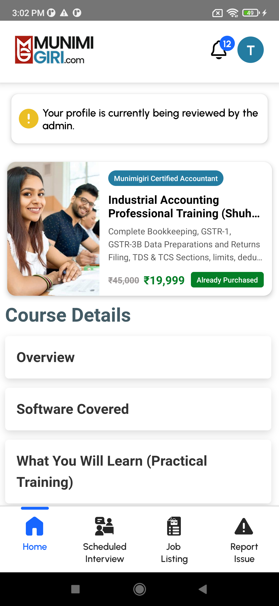
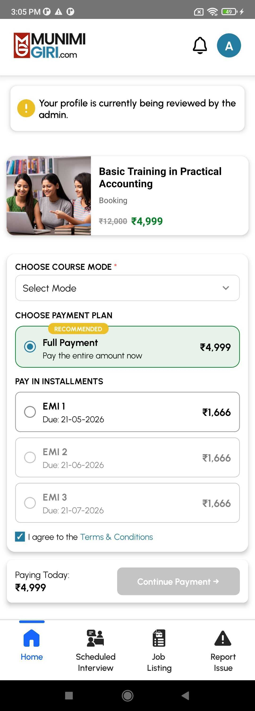

# Changes 17 - Apr - 2026 (Candidate Flow)

## Current Issue - [X] Course Purchase screen - Payment plan selection issue.(22 / Apr / 2026)

## Pending task - DFD for the current changes are not yet created.

### 1. Courses List -

	a. [X] UI for showing the list of the courses // Estimated Time: 8 hr
	b. [X] Implementing Get course list api for getting list of courses	// Estimated Time: 4 hr

### 2. Course Details -

	2.1 [X] Course Details Preview -
		a. [X] UI for showing the details of the selected course  // Estimated Time: 4 hr
		b. [X] Implementing Get course details api for getting details of a specific course // Estimated Time: 4 hr

	2.2 [X] Course Sub details module
		a. [X] UI for showing the sub details like Overview, Software covered etc. // Estimated Time: 4 hr

### 3. Purchase Course  / Payment Screen-

	a. [X] UI for purchase options (like full payment or emi options) and course final options(like online, offline, hybrid). // Estimated Time: 4 hr
	b. [X] Razor Pay implementation with payment api implementation for successfull payments. // Estimated Time: 4 hr

### 4. Course History -

	4.1 Purchase list
		a. [X] UI for showing the course purchase / applied history of the user // Estimated Time: 4 hr
		b. [X] Api for getting the history of the candidates purchases. // Estimated Time: 4 hr
	
	4.2 Installment Lists
		a. [X] Showing the installment details of the selected purchase to the candidate // Estimated Time: 2 hr

	4.3 Payment Screen - 
		a. [X] Showing currently due installments.  // Estimated Time: 4 hr
		b. [X] Razor Pay integration with payment api implementation for successfull payments..  // Estimated Time: 4 hr

### 6. Candidate Dashboard - Confirmed
Apply complete profile check to enable preinterview and verify options to the candidate.

### 7. Cadidate Job Details - Confirmed
Adding a (__condition(may be cadidate's subscription bases)__) check over jobs list for showing the more or less details to the candidate.
