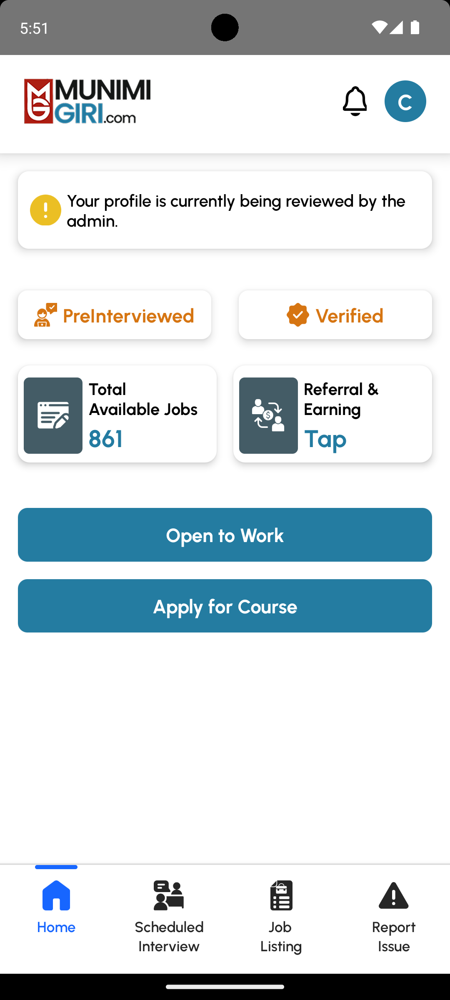
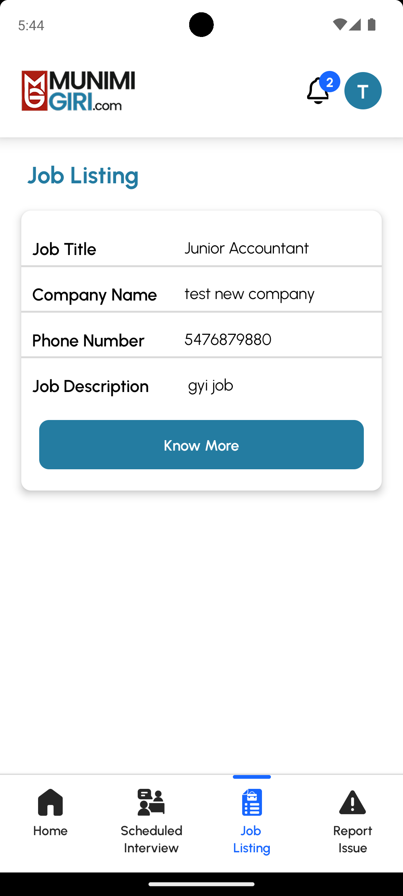
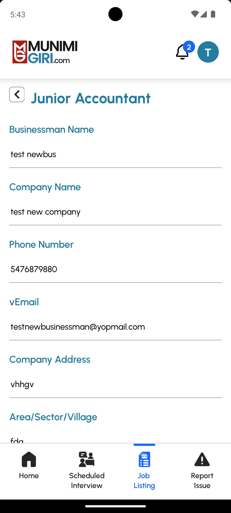
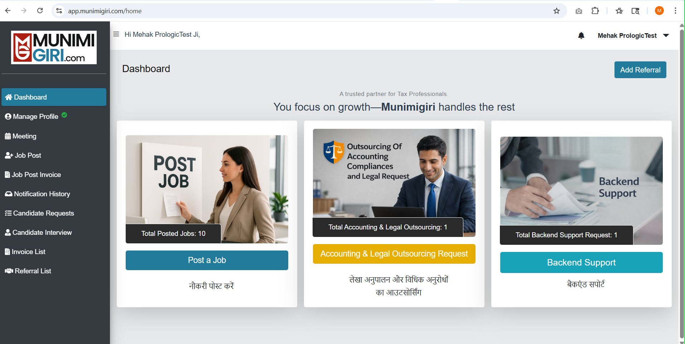
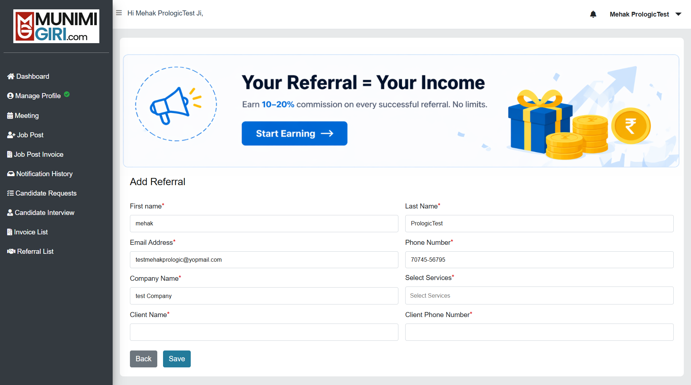
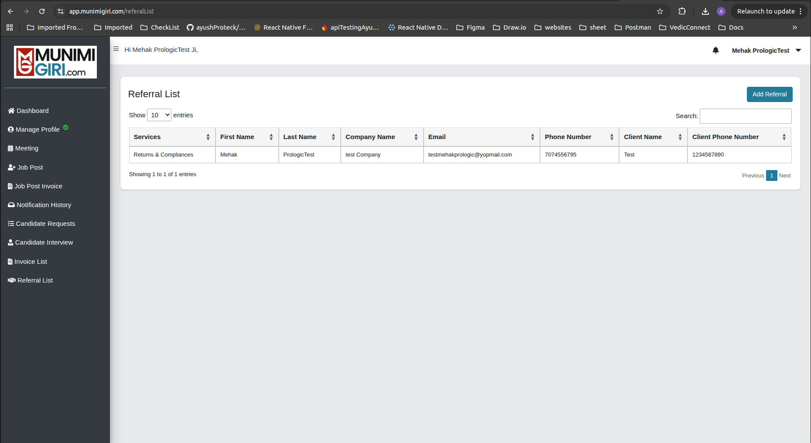
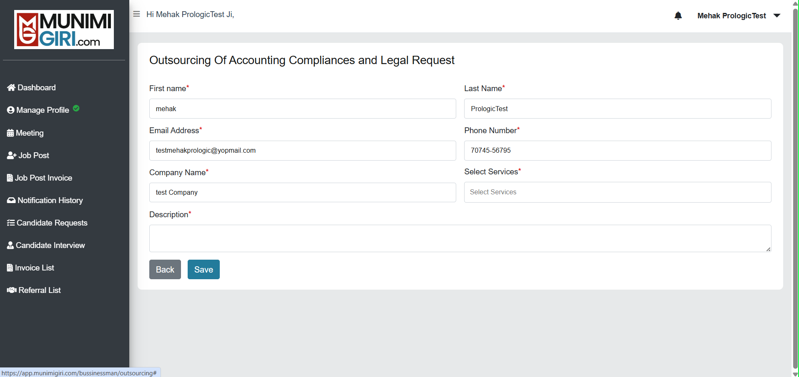
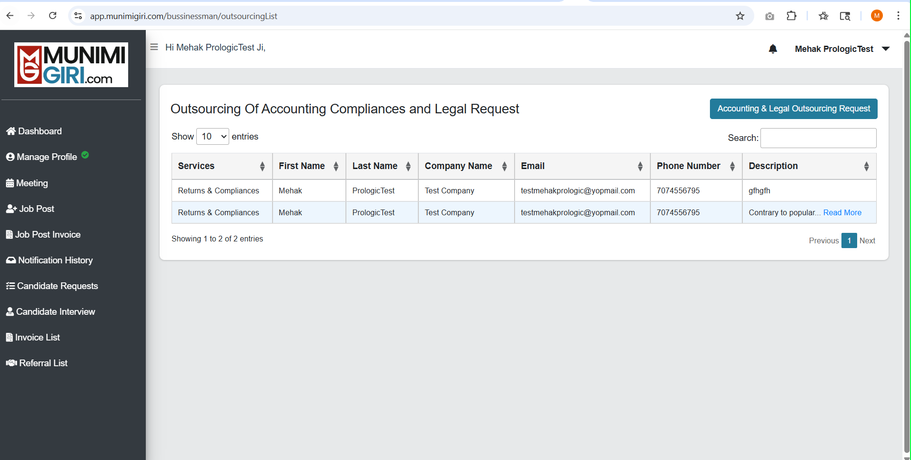
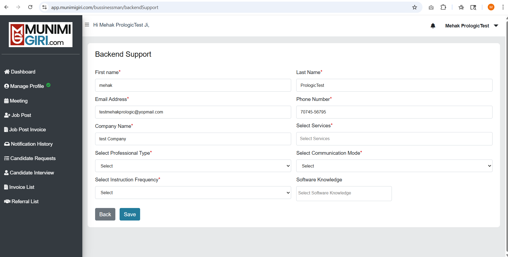
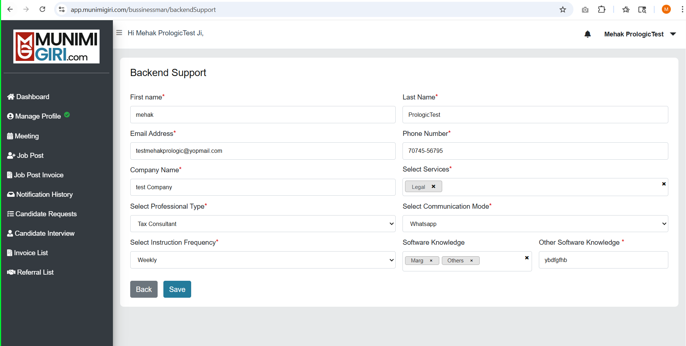

# Bussiness Man Flow

---
## Candidates (local)
1. fGgYft6S2YWfJYHh_DoA3lYzMXlDUT09 | testnewcandidates@yopmail.com
2. NxlcdXqk6_5NyT30iZeiyGF4VU5CQT09 | candidatetest@yopmail.com

## Bussiness (local)
 testmehakprologic@yopmail.com
---

## Yet to do:

### 1. Candidate Dashboard - Confirmed
Apply complete profile check to enable preinterview and verify options to the candidate.

### 2. Cadidate Job Details - Confirmed
Adding a (__condition( job.id == '1' )[on cadidate's subscription bases]__) check over jobs list for showing the more or less details (Phone number only) to the candidate.

### 3.
---

## Service Request - closed

---

## Create referal form for both businessman and candidate (Remove previous referal functionality) and show listing and removal of Referral from Candidate flow

### 1. Referral button (for navigation)

### 2. Referral Form - after successfull submittion user will go to referral list.

### 3. Referral List

## Create outsourcing and backend support form for tax profession businessman and show its listing in businessman module (Tax Profession ) - Remove Service Request feature.

### 1. Businessman Dashboard :

### 2. Outsourcing Form - with some prefilled detials from profile api - after successfull submittion user will go to outsourcing list.

### 3. Outsourcing list - showing the list of outsourcing form details filled by the user.

### 4. backend support form - with with some prefilled detials from profile api

### 5. backend list - showing the list of backend form details filled by the user.
