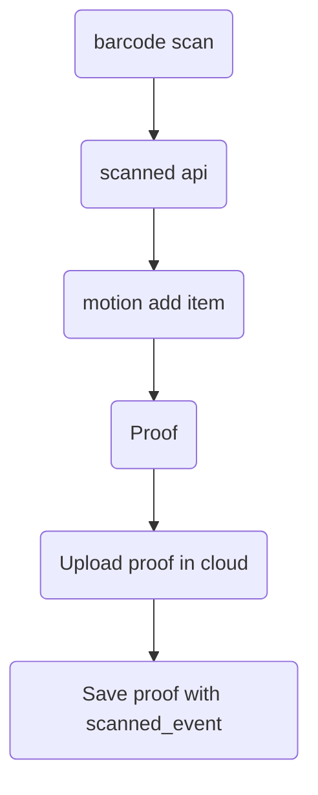

# Important

## (17 / Mar / 2026)(./2026-03-17.md)
## (18 / Mar / 2026)(./2026-03-18.md)

Events flow:-

Main / Clean Flow:

```mermaid
flowchart TD
scan(barcode scan)
scanApi(scanned api)
addedProductDetected(motion add item)
proofReady(Proof)
uploadVideo(Upload proof in cloud)
saveAddItem(Save proof with scanned_event)

scan --> 
scanApi --> 
addedProductDetected --> 
proofReady --> 
uploadVideo --> 
saveAddItem

```
