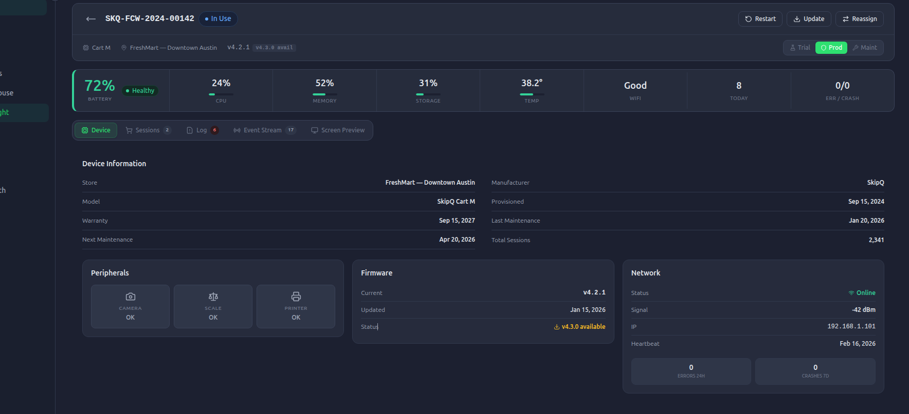

# Tasks:

## I. Configurable Settings(Branding):

### Desciption

	1. Text: Getting Json files or object for text messages and 
	2. Images: Brand images to be shown in the application.
	3. Theme: Color theme to be followed with in the applciation 

```JSON
{
	"messages": {
		"en": {
		  "welcome-message": "Welcome to the Seamless Shopping Experience",
		  "get-Continue": "Continue",
		  "login-instruction-bar": "Enter Mobile Number or Scan QR to Get Started",
		  "enter-phone": "Enter Your Mobile Number",
		  "qr-code": "Scan QR Code to Connect Your Cart",
		  "otp-instruction-bar": "Enter OTP to Get Started",
		  "enter-otp": "Enter OTP",
		  "4-digit-otp": "Enter the 4-digit OTP sent to your mobile",
		  "resend-otp-in": "Resend OTP in {{cooldown}}s",
		  "did-not-receive-otp": "Did not receive OTP?",
		  "resend": "Resend",
		  "or": "Or",
		  "clear": "CLEAR",
		  "powered-by": "Powered by",
		  "cart-id": "Cart Id",
		  "items": "Items",
		  "start-time": "Start Time",
		  "device-id": "Device ID",
		  "promos-and-offers": "Promos & Offers",
		  "subtotal": "Subtotal",
		  "savings": "Savings",
		  "no-product": "You can start adding items to your cart",
		  "pay": "Pay",
		  "head-to-checkout": "Head to the checkout area",
		  "quantity": "Qty",
		  "checkout-success": "Thank you for your purchase! Your order has been successfully processed.",
		  "grandtotal": "Subtotal",
		  "total": "Total",
		  "tax": "Tax",
		  "amount-due": "Amount Due",
		  "checkout": "CheckOut",
		  "apply-promo": "Apply Promo Code",
		  "enter-promo": "Enter Promo Code",
		  "payment-method": "Select Payment Method",
		  "credit-debit-card": "Credit / Debit Card",
		  "discount": "Discount",
		  "promo-applied": "Promo code applied successfully!",
		  "invalid-promo": "Invalid promo code. Please try again.",
		  "order-list": "Order List",
		  "your-cart-is-empty": "Your cart is empty",
		  "retry": "Retry",
		  "apply": "Apply",
		  "remove": "Remove",
		  "no-promos-available": "No promos available",
		  "pay-at-self-serve": "Pay at self-serve checkout",
		  "help": "Help",
		  "back": "Back",
		  "logout": "Logout",
		  "saved-cards": "Saved Cards",
		  "other-payment-methods": "Other Payment Methods",
		  "processing": "Processing...",
		  "payment-successful": "Payment Successful!",
		  "order-id": "Order ID",
		  "payment-time": "Payment Time",
		  "card": "Card",
		  "redirecting-in": "Redirecting in {{seconds}}s...",
		  "select-payment-method": "Select a Payment Method",
		  "pay-with-saved-card": "Pay with Saved Card",
		  "no-saved-cards-found": "No saved cards found",
		  "enter-card-details": "Enter Card Details",
		  "card-number": "Card Number",
		  "item-id": "Item {{id}}",
		  "unit": "Unit",
		  "qty-label": "Qty: {{quantity}}",
		  "thank-you-for-shopping": "Thank you for shopping",
		  "invalid-card-details": "Please enter valid card details",
		  "promo-removed-min-amount": "Promo code removed as minimum purchase amount not met",
		  "personal-items": "Personal Items",
		  "have-personal-items": "Do you have personal items?",
		  "personal-items-mode-active": "Personal items mode active. Place your items - green LED will confirm detection.",
		  "personal-items-active": "Personal Items Mode Active",
		  "place-personal-item-now": "Place your personal item now",
		  "personal-item-added": "Personal item added successfully",
		  "personal-items-mode-ended": "Personal items mode ended. Normal operation resumed.",
		  "done": "Done",
		  "yes": "Yes",
		  "no": "No",
		  "place-item-in-cart": "Please place the personal items in the cart",
		  "put-item-in-cart": "Put the product in the cart now",
		  "recording-baseline": "Recording baseline... Please wait",
		  "cart-locked": "Cart Locked - Please resolve item removal",
		  "what-item-removed": "What item have you removed?",
		  "show-list": "1. Show list",
		  "scan-barcode": "2. Scan Barcode",
		  "select-item-to-remove": "Scan the removed product or Reduce the quantity from the list",
		  "scan-item-to-remove": "Please scan the product you removed",
		  "waiting-for-scan": "Waiting for barcode scan...",
		  "are-you-sure-abandon": "Are you sure you want to abandon cart?",
		  "cancel": "Cancel",
		  "error": "Error",
		  "something-went-wrong": "Something went wrong. Please try again.",
		  "hil-interference-detected": "Manual verification required!",
		  "hil-interference-detected-message": "Please speak to the store's staff for approval.",
		  "ok": "Ok",
		  "close": "Close",
		  "confirm": "Confirm",
		  "select-products-to-remove": "Please select the products to remove",
		  "scan-required": "Scan Required",
		  "please-scan-item-added": "What you have put into the cart, please scan the product.",
		  "i-will-scan-it": "I WILL SCAN IT",
		  "i-did-nothing": "I DID NOTHING",
		  "i-have-remove-a-personalItem": "I have removed a personal item",
		  "store-approval-pending": "Store approval pending",
		  "cart-init-welcome": "Scan your first item to start shopping.",
		  "adjust-quantity-modal-message": "Update the quantity for this item as needed",
		  "adjust-quantity-modal-title": "Adjust Quantity",
		  "adjust-quantity-modal-help-title": "Adjust Quantity Help",
		  "get-otp": "Get OTP",
		  "start": "Start",
		  "auth-help": "Login?",
		  "item-added-success": "Item added successfully",
		  "staff": {
		    "headers": {
		      "dashboard": "Staff Dashboard"
		    },
		    "tabs": {
		      "all": "All Items",
		      "unchecked": "Unchecked Items",
		      "rejected": "Rejected Items",
		      "age_verification": "Age Verification",
		      "escalated": "Escalated"
		    },
		    "messages": {
		      "no_unchecked": "No unchecked items.",
		      "no_approved": "No approved items.",
		      "no_rejected": "No rejected items.",
		      "no_escalated": "No escalated items.",
		      "no_age_verification": "No items pending age verification.",
		      "yet_to_shop": "User is yet to shop.",
		      "no_hil_found": "No HIL items found."
		    },
		    "labels": {
		      "items_in_cart": "Items in the cart",
		      "qty": "Qty",
		      "total_items": "Total Items"
		    },
		    "status": {
		      "approved": "Approved",
		      "escalated": "Escalated"
		    },
		    "buttons": {
		      "approve": "APPROVE",
		      "escalate": "ESCALATE",
		      "reject": "REJECT",
		      "abandon_cart": "Abandon Cart",
		      "continue_shopping": "Continue Shopping",
		      "proceed_to_checkout": "Proceed to Checkout"
		    },
		    "modals": {
		      "abandon_cart": {
		        "title": "Abandon Cart"
		      },
		      "escalate": {
		        "title": "Escalate"
		      }
		    }
		  }
		},
		"ar": {
		  "welcome-message": "مرحبًا بك في تجربة التسوق بدون توقف",
		  "get-Continue": "متابعة",
		  "login-instruction-bar": "أدخل رقم الهاتف المحمول أو امسح رمز الاستجابة السريعة للبدء",
		  "enter-phone": "أدخل رقم هاتفك المحمول",
		  "qr-code": "امسح رمز الاستجابة السريعة لربط عربتك",
		  "otp-instruction-bar": "أدخل رمز التحقق (OTP) للبدء",
		  "enter-otp": "أدخل رمز التحقق",
		  "4-digit-otp": "أدخل رمز التحقق المكون من 4 أرقام المرسل إلى هاتفك المحمول",
		  "resend-otp-in": "إعادة إرسال رمز التحقق خلال {{cooldown}} ثانية",
		  "did-not-receive-otp": "لم تستلم رمز التحقق؟",
		  "resend": "إعادة إرسال",
		  "or": "أو",
		  "clear": "مسح",
		  "powered-by": "مدعوم من",
		  "cart-id": "معرف سلة التسوق",
		  "items": "أغراض",
		  "start-time": "وقت البدء",
		  "device-id": "معرف الجهاز",
		  "promos-and-offers": "العروض والتخفيضات",
		  "subtotal": "المجموع الفرعي",
		  "savings": "الادخار",
		  "no-product": "يمكنك البدء بإضافة العناصر إلى سلة التسوق الخاصة بك",
		  "pay": "دفع",
		  "head-to-checkout": "توجه إلى منطقة الخروج",
		  "quantity": "كمية",
		  "checkout-success": "شكراً لشرائك! تم معالجة طلبك بنجاح.",
		  "grandtotal": "المجموع الفرعي",
		  "total": "المجموع",
		  "tax": "ضريبة",
		  "amount-due": "المبلغ المستحق",
		  "checkout": "الدفع",
		  "apply-promo": "تطبيق رمز الترويجي",
		  "enter-promo": "أدخل رمز الترويجي",
		  "payment-method": "اختر طريقة الدفع",
		  "credit-debit-card": "بطاقة الائتمان / الخصم",
		  "discount": "تخفيض",
		  "promo-applied": "تم تطبيق رمز الترويجي بنجاح!",
		  "invalid-promo": "رمز ترويجي غير صالح. يرجى المحاولة مرة أخرى.",
		  "order-list": "قائمة الطلبات",
		  "your-cart-is-empty": "سلة التسوق الخاصة بك فارغة",
		  "retry": "إعادة المحاولة",
		  "apply": "تطبيق",
		  "remove": "إزالة",
		  "no-promos-available": "لا توجد عروض متاحة",
		  "pay-at-self-serve": "الدفع عند الخروج الذاتي",
		  "help": "مساعدة",
		  "back": "رجوع",
		  "logout": "تسجيل الخروج",
		  "saved-cards": "البطاقات المحفوظة",
		  "other-payment-methods": "طرق دفع أخرى",
		  "processing": "جاري المعالجة...",
		  "payment-successful": "تم الدفع بنجاح!",
		  "order-id": "رقم الطلب",
		  "payment-time": "وقت الدفع",
		  "card": "بطاقة",
		  "redirecting-in": "إعادة التوجيه خلال {{seconds}} ثانية...",
		  "select-payment-method": "اختر طريقة الدفع",
		  "pay-with-saved-card": "الدفع بالبطاقة المحفوظة",
		  "no-saved-cards-found": "لم يتم العثور على بطاقات محفوظة",
		  "enter-card-details": "أدخل تفاصيل البطاقة",
		  "card-number": "رقم البطاقة",
		  "item-id": "عنصر {{id}}",
		  "unit": "وحدة",
		  "qty-label": "الكمية: {{quantity}}",
		  "thank-you-for-shopping": "شكراً لتسوقكم معنا",
		  "invalid-card-details": "يرجى إدخال تفاصيل البطاقة الصحيحة",
		  "promo-removed-min-amount": "تمت إزالة الرمز الترويجي لعدم استيفاء الحد الأدنى لمبلغ الشراء",
		  "personal-items": "أغراض شخصية",
		  "have-personal-items": "إذا كانت لديك أغراض شخصية، فيرجى وضعها في سلة التسوق الخاصة بك واختيار 'تأكيد' للمتابعة.",
		  "personal-items-mode-active": "وضع الأغراض الشخصية نشط. ضع أغراضك - سيؤكد الضوء الأخضر الكشف.",
		  "personal-items-active": "وضع الأغراض الشخصية نشط",
		  "place-personal-item-now": "ضع أغراضك الشخصية الآن",
		  "personal-item-added": "تمت إضافة الأغراض الشخصية بنجاح",
		  "personal-items-mode-ended": "انتهى وضع الأغراض الشخصية. تم استئناف العملية العادية.",
		  "done": "تم",
		  "yes": "نعم",
		  "no": "لا",
		  "place-item-in-cart": "يرجى وضع العنصر في سلة التسوق",
		  "put-item-in-cart": "ضع المنتج في السلة الآن",
		  "recording-baseline": "تسجيل الأساس... يرجى الانتظار",
		  "cart-locked": "السلة مقفلة - يرجى حل إزالة العنصر",
		  "what-item-removed": "ما العنصر الذي أزلته؟",
		  "show-list": "1. إظهار القائمة",
		  "scan-barcode": "2. مسح الباركود",
		  "select-item-to-remove": "حدد العنصر المراد إزالته",
		  "scan-item-to-remove": "يرجى مسح المنتج الذي أزلته",
		  "waiting-for-scan": "في انتظار مسح الباركود...",
		  "are-you-sure-abandon": "هل أنت متأكد أنك تريد التخلي عن عربة التسوق؟",
		  "cancel": "إلغاء",
		  "error": "خطأ",
		  "something-went-wrong": "حدث خطأ ما. يرجى المحاولة مرة أخرى.",
		  "hil-interference-detected": "يتطلب تحققاً يدوياً!",
		  "hil-interference-detected-message": "يُرجى التحدث إلى موظفي المتجر للحصول على الموافقة",
		  "ok": "تمام",
		  "close": "يغلق",
		  "select-products-to-remove": "يرجى اختيار المنتجات المراد إزالته",
		  "confirm": "تأكيد",
		  "i-have-remove-a-personalItem": "لقد أزلت عنصرًا شخصيًا",
		  "store-approval-pending": "بانتظار موافقة المتجر",
		  "cart-init-welcome": "امسح ضوئياً أول صنف لبدء التسوق.",
		  "adjust-quantity-modal-message": "حدّث كمية هذا الصنف حسب الحاجة.",
		  "adjust-quantity-modal-title": "تعديل الكمية",
		  "adjust-quantity-modal-help-title": "المساعدة في تعديل الكمية",
		  "get-otp": "يحصل (OTP)",
		  "start": "يبدأ",
		  "auth-help": "تسجيل الدخول؟",
		  "item-added-success": "تمت إضافة العنصر بنجاح",
		  "staff": {
		    "headers": {
		      "dashboard": "لوحة تحكم الموظفين"
		    },
		    "tabs": {
		      "all": "كل العناصر",
		      "unchecked": "عناصر غير مدققة",
		      "rejected": "عناصر مرفوضة",
		      "age_verification": "التحقق من العمر",
		      "escalated": "تصاعدت"
		    },
		    "messages": {
		      "no_unchecked": "لا توجد عناصر غير مدققة.",
		      "no_approved": "لا توجد عناصر معتمدة.",
		      "no_rejected": "لا توجد عناصر مرفوضة.",
		      "no_escalated": "لا توجد عناصر مُصعّدة.",
		      "no_age_verification": "لا توجد عناصر في انتظار التحقق من العمر.",
		      "yet_to_shop": "المستخدم لم يتسوق بعد.",
		      "no_hil_found": "لم يتم العثور على عناصر HIL."
		    },
		    "labels": {
		      "items_in_cart": "العناصر الموجودة في العربة",
		      "qty": "الكمية",
		      "total_items": "إجمالي العناصر"
		    },
		    "status": {
		      "approved": "معتمد",
		      "escalated": "تصاعدت"
		    },
		    "buttons": {
		      "approve": "اعتماد",
		      "reject": "رفض",
		      "escalate": "تصعيد",
		      "abandon_cart": "ترك العربة",
		      "continue_shopping": "مواصلة التسوق",
		      "proceed_to_checkout": "الانتقال إلى الدفع"
		    },
		    "modals": {
		      "abandon_cart": {
		        "title": "ترك العربة"
		      },
		      "escalate": {
		        "title": "تصعيد"
		      }
		    }
		  }
		}
	},
	"Images": {
		"brand_image": "https://images-link"
	},
	"colors": {
	  	"primary": {
		    "main": "#BBF743",
		    "light": "#D4FF6B",
		    "dark": "#A3E635",
		  },
	  	"secondary": {
		    "main": "#4A90E2",
		    "light": "#6CA3E8",
		    "dark": "#2E5BB8",
		  },
	  	"accent": {
		    "lime": "#ADFF2F",
		    "yellow": "#FDE400",
		    "lightBlue": "#E8F1FA",
		  },
	  	"semantic": {
		    "success": "#34C759",
		    "successAlt": "#4CAF50",
		    "error": "#FF3B30",
		    "warning": "#FF9500",
		    "info": "#2196F3",
		  },
		"background": {
			"primary": "#F2F2F7",
			"secondary": "#F5F5F5",
			"tertiary": "#FAFAFA",
			"light": "#F0F0F0",
			"white": "#FFFFFF",
		  },
		"text": {
			"primary": "#000000",
			"dark": "#333333",
		    "secondary": "#666666",
		    "tertiary": "#999999",
		    "disabled": "#CCCCCC",
		    "light": "#AAAAAA",
		    "white": "#FFFFFF",
		  },
	  	"border": {
		    "primary": "#E0E0E0",
		    "light": "#F0F0F0",
		    "lighter": "#EEEEEE",
		    "dark": "#CCCCCC",
		  },
	  	"grayscale": {
	    "white": "#FFFFFF",
	    "gray50": "#FAFAFA",
	    "gray100": "#F5F5F5",
	    "gray200": "#F0F0F0",
	    "gray300": "#EEEEEE",
	    "gray400": "#E0E0E0",
	    "gray500": "#CCCCCC",
	    "gray600": "#AAAAAA",
	    "gray700": "#999999",
	    "gray800": "#666666",
	    "gray900": "#333333",
	    "black": "#000000",
	    "blackTransparent": "#0000",
	  },
	}
}

```

### Tasks:
	
	1. Getting the branding data and storing it in redux.
	2. Implementing styling from the api data stored in the redux.
		a. Text: Implementing languages from reduxit in place of i18n
		b. Images: mapping images url from redux with their designated places.
		c. Theme:
			i. Setting up hooks for every screen for making the styling dynamic.
			ii. Setting the theme from api in such a way that it can switch between the custom theme and static theme. 


## II. Device State Update with backend:

### Desciption

	1. setting api calling for sending the device details after every 1 minute.

### Tasks

	1. R&D for third party library to get device's details like:
		a. Battery Status in percentage
		b. CPU Usages Status in percentage
		c. Memory Usages Status in percentage
		d. Storage Usage Status in percentage
		e. Temperature in Celcius
		f. WIFI Connection Status - Good | Bad
		g. Peripherals status 
			i. Camera - On | Off
			ii. Scale - Ok | Not Ok
			iii. Printer - Ok | Not Ok*
		h. Network Details
			i. Status - Online | Offline
			ii. Signal Strength - in dBm
			iii. IP address - IPv4




## Device Health Monitoring Hook (React Native)

### 📌 Overview
This document outlines the implementation of a `useDeviceHealth` hook that collects device metrics and sends them to a backend API.

The solution is designed to:
- Use available React Native libraries
- Gracefully handle platform limitations
- Provide a scalable and production-ready structure

---

### 🧱 Tech Stack

#### Core Libraries
- react-native-device-info
- @react-native-community/netinfo (recommended)

#### Optional Enhancements
- react-native-network-info (for IP)
- react-native-ble-plx (for peripherals)
- Native modules (Android-only advanced metrics)

---

### ⚠️ Limitations

| Feature | Android | iOS |
|--------|--------|-----|
| CPU Usage | ✅ (native only) | ❌ |
| Temperature | ⚠️ limited | ❌ |
| Signal Strength | ✅ | ❌ |
| Camera Status | ❌ | ❌ |

---

### 🧠 Data Model

```ts
export interface DeviceHealthPayload {
  battery: number;
  memoryUsage: number;
  storageUsage: number;
  isConnected: boolean;
  ipAddress?: string;

  // Optional / Android-only
  cpuUsage?: number;
  temperature?: number;
  signalStrength?: number;

  timestamp: number;
}

```

### ⚙️ Utility Function

```ts
export const calculatePercentage = (used: number, total: number) => {
  if (!total) return 0;
  return (used / total) * 100;
};
```

### 🔌 Device Health Service

```ts
import DeviceInfo from 'react-native-device-info';
import NetInfo from '@react-native-community/netinfo';

export const getDeviceHealthData = async () => {
  const battery = await DeviceInfo.getBatteryLevel();

  const usedMemory = await DeviceInfo.getUsedMemory();
  const totalMemory = await DeviceInfo.getTotalMemory();

  const totalStorage = await DeviceInfo.getTotalDiskCapacity();
  const freeStorage = await DeviceInfo.getFreeDiskStorage();

  const netState = await NetInfo.fetch();

  return {
    battery,
    memoryUsage: (usedMemory / totalMemory) * 100,
    storageUsage: ((totalStorage - freeStorage) / totalStorage) * 100,
    isConnected: netState.isConnected ?? false,
    timestamp: Date.now(),
  };
};
```

### 🔁 API Service

```ts
import axios from 'axios';

export const sendDeviceHealth = async (payload: any) => {
  try {
    await axios.post('/device/health', payload);
  } catch (error) {
    console.log('Failed to send device health', error);
  }
};
```

### 🪝 useDeviceHealth Hook

```ts
import { useEffect, useRef } from 'react';
import { getDeviceHealthData } from '../services/deviceHealthService';
import { sendDeviceHealth } from '../services/apiService';

export const useDeviceHealth = (interval = 30000) => {
  const timerRef = useRef<NodeJS.Timeout | null>(null);

  const collectAndSend = async () => {
    const data = await getDeviceHealthData();
    await sendDeviceHealth(data);
  };

  useEffect(() => {
    collectAndSend();

    timerRef.current = setInterval(() => {
      collectAndSend();
    }, interval);

    return () => {
      if (timerRef.current) {
        clearInterval(timerRef.current);
      }
    };
  }, []);
};
```

### 🚀 Usage

```ts
import { useDeviceHealth } from './hooks/useDeviceHealth';

const App = () => {
  useDeviceHealth(30000); // every 30 sec

  return null;
};
```